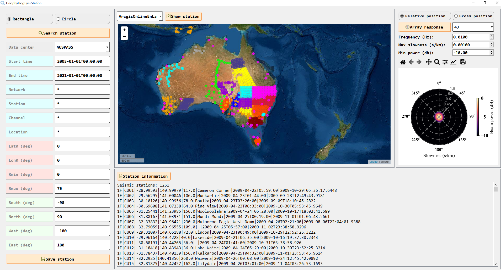

## :one: Station and earthquake searching based on the FDSN web services ([FDSNWS](http://www.fdsn.org/webservices/datacenters/)).
	The motivation of developing these FDSNWS-based searching tools is that the internet may go wrong when showing data on web page.
	The slow network speeed in some regions also urges us to build some graphical user interface (GUI) to help us to conduct the furture work of processing seismic data.
	
	In folder `Station_Earthquake_Searching`, someone can find two searching tools:
		`widget_earthquake.py` and `widget_station.py`, and we can use them to search earthquakes and seismic stations from different data centers.

### Dependencies:
	`Python3.7 (Anaconda3.5.3.0)`	
	`PyQt5`
	`matplotlib`
	`folium`
	`numpy`

### Examples:
	
	
	

